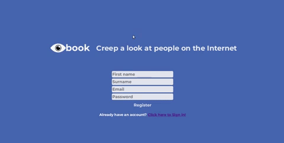

# Eyebook

### Summary
One-page social network application.

### Tech used
  - Javascript
  - React.js
  - Redux
  - AWS S3 Cloud Storage
  - PostgreSQL databases
  - Socket IO
  - Express.js
  - Node.js
  - Webpack as a module bundler
  - HTML
  - CSS

### Features
  - Registration form
  - Login form
  - Logout option
  - Profile pic uploader
  - Profile bio
  - Send/cancel friend requests
  - Friend/Unfriend someone
  - See other people's profiles
  - See online users
  - See friends and people who've sent you a friend request
  - Chat room

### Set-up
This repo contains a package.json that lists all of the dependencies the project is expected to require. To install them, cd into the directory and type the following.

    $npm install

You will also need an AWS account.

### TODOs
1. Fix bugs:
    - Error while trying to register with an already registered email
    - Error while trying to register without all input fields filled
2. Improve:
    - Clear text box after sending message in the chat room
    - Incorporate online users in the chat room
    - Improve front-end on the friends/wannabes page
2. Add new features:
    - Include option to deregister
    - Add a user search bar
    - Allow users to send private messages
